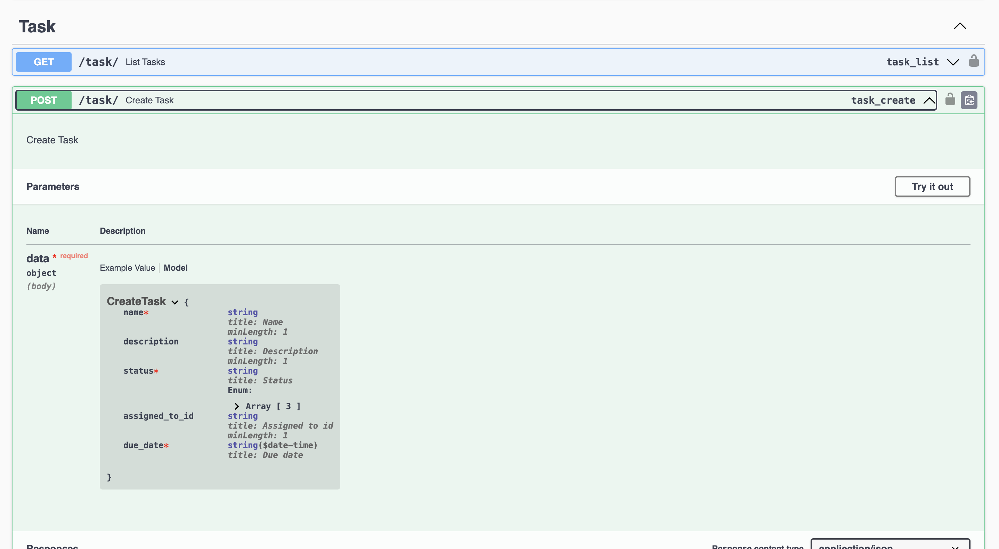
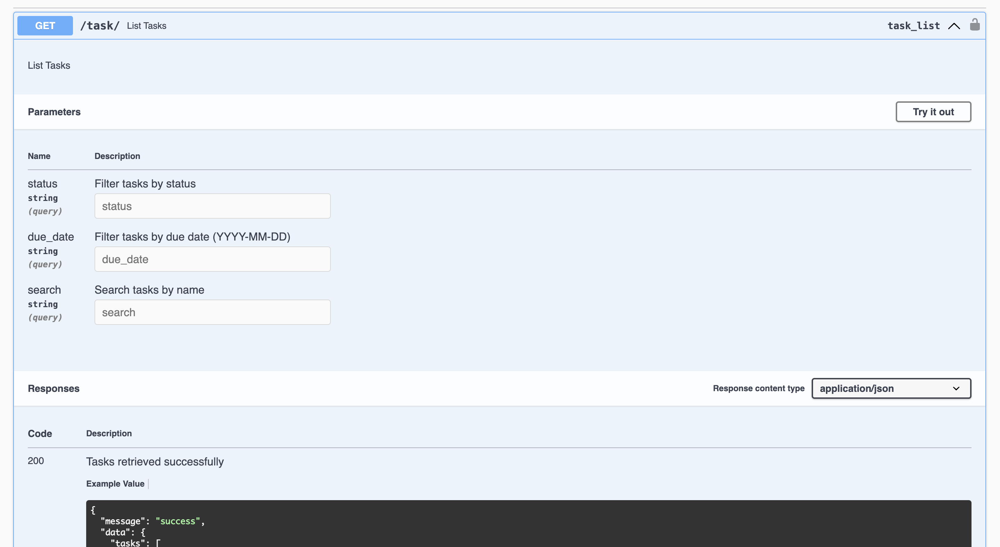

# Task Manager

## Project description.
This is a task manager API that helps users create, update, view and delete tasks. Users can filter tasks based on task's `due_date`, `status` and a user can also search through all the available task

## Setup instructions.
The app is containerized using Docker, make sure you have Docker installed on your machine

* clone the app `git clone https://github.com/funsojoba/task_manager.git`
* cd into the app directory `cd task_manager`
* open the folder in your code editor 
* Build docker using this command `make build`
* Start docker container using this command `make up`
* The app will run here `http://0.0.0.0:8000/` you can visit the URL to see the swagger document generated for the available APIs

* You can also take a look at the `Makefile` for other relevant commands

## Instructions on how to run the tests.

To test the endpoints, run `make test`
To see test coverage, run `make test-coverage`

## API documentation 
THe documentation for this API is generate using Swagger, it has the expected responses and payload (for endpoints that require payload) for each endpoint

---

Happy Hacking 🎉